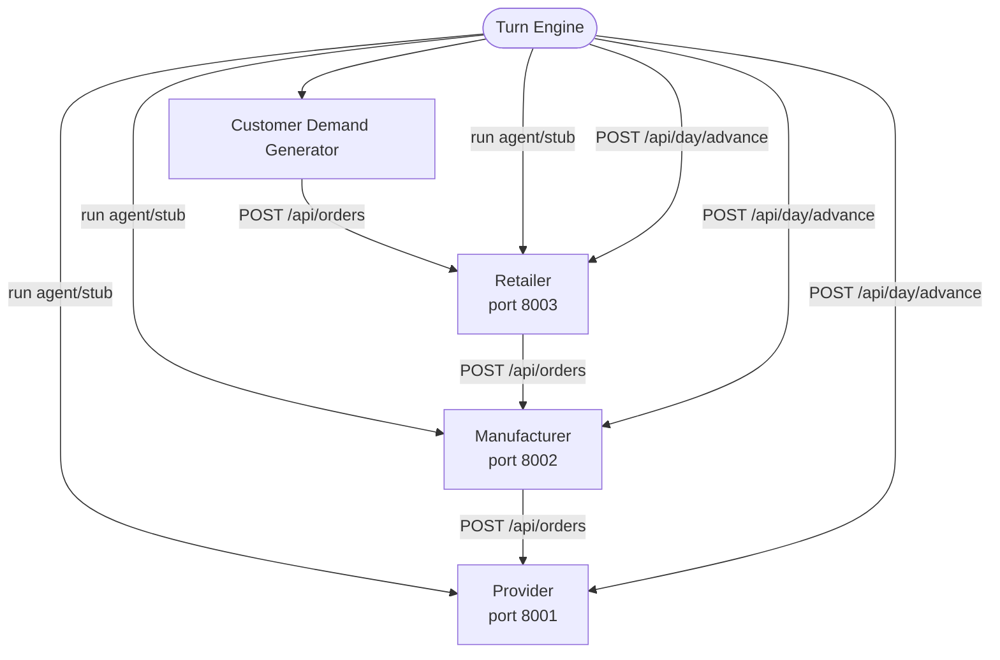

# Week 7: Supply Chain Completa con Turn Engine y Agente Claude

## 1. Cómo ejecutar

### Requisitos previos
```bash
cd week-07
python -m venv .venv312
# Windows:
.venv312\Scripts\Activate.ps1
# Mac/Linux:
source .venv312/bin/activate

pip install -r provider/requirements.txt -r manufacturer/requirements.txt -r retailer/requirements.txt
```

### Arrancar las tres apps (terminales separadas)
```bash
# Terminal 1 — Provider (port 8001)
cd week-07/provider
python -m uvicorn src.main:app --port 8001

# Terminal 2 — Manufacturer (port 8002)
cd week-07/manufacturer
python -m uvicorn src.main:app --port 8002

# Terminal 3 — Retailer (port 8003)
cd week-07/retailer
python -m uvicorn src.main:app --port 8003
```

Swagger disponible en `http://localhost:8001/docs`, `8002/docs`, `8003/docs`.
UI del manufacturer en `http://localhost:8002`.

### Ejecutar la simulación
```bash
# Terminal 4 — desde week-07/
# Modo stub: 3 días determinísticos
python turn_engine.py config/sim.json scenarios/smoke-test.json 3

# Modo agente: 1 día con Claude tomando decisiones reales
python turn_engine.py config/sim.json scenarios/smoke-test.json 1 --agent manufacturer
```

### Reset estado
```powershell
# Windows
Remove-Item "$env:TEMP\week07-*.db*" -Force
# Linux/Mac
rm /tmp/week07-*.db*
```

---

## 2. Arquitectura del sistema



**Flujo de datos por turno:**
1. Turn Engine lee las señales del scenario file
2. Genera N órdenes de clientes → Retailer
3. Retailer (stub/agente) decide fulfill stock y compra al Manufacturer
4. Manufacturer (stub/agente) libera producción y compra materiales al Provider
5. Provider avanza (recibe entregas, nada activo)
6. Turn Engine avanza el día: Provider → Manufacturer → Retailer

---

## 3. Turn Engine y Skill File

El orden downstream → upstream es clave. El Retailer actúa primero porque su demanda define qué necesita el Manufacturer. Si invirtiéramos el orden, el Manufacturer estaría comprando materiales sin saber cuántos pedidos llegarán ese turno.

**Dos modos:**
- **Stub**: decisiones deterministas vía HTTP (libera todo lo que puede, compra si stock < 2)
- **Agent**: invoca `claude --print --allowedTools Bash` con el skill file vía stdin, captura output en `logs/`

El archivo `skills/manufacturer-manager.md` enseña a Claude el rol con 5 secciones:
- `## Your Role` — descripción del rol de gerente de fábrica
- `## Available Commands` — todos los comandos CLI disponibles
- `## DO NOT` — nunca llamar a day advance (el turn engine lo hace)
- `## Decision Framework` — 5 pasos ordenados
- `## When Done` — imprimir resumen, no avanzar el día

La sección **DO NOT** es la más importante. Sin ella Claude intenta avanzar el día por su cuenta porque es el paso lógico siguiente — y eso rompe la simulación.

---

## 4. Output del agente (day 1, modo agent)

```
Turn Engine — smoke-test | Day 1 | normal (modifier=1.0)

[Demand] Injected: 3/3 customer orders accepted

[Retailer Stub] Ordered 3x P3D-Classic from manufacturer
[Retailer Stub] Ordered 3x P3D-Pro from manufacturer

[Agent] Running claude for manufacturer (day 1)...

Ordering 20 pcb from ChipSupply Co: stock will be 2 after production,
expected demand requires 3 for Pro order + buffer. Arrives day 4.

Day 1 Summary:
- 1 order released — Order #1 (P3D-Classic x3, $1,500): materials ok, capacity ok.
- 1 order held — Order #2 (P3D-Pro x3, $2,400): only 5 PCBs, need 6 total;
  Classic gets priority (arrived first, fewer parts).
- 1 purchase order placed — 20 PCBs from ChipSupply Co at $28.50/unit (tier price).
- Concern: PCB is the critical bottleneck — stock will drop to 2 after Classic production.
- Tomorrow: Classic x3 enters production, Pro order remains pending until day 4.
```

**Qué hizo bien:** entendió la restricción de materiales (PCBs cuello de botella), calculó prioridad correctamente (Classic primero, usa menos PCBs), calculó precio por tier ($28.50 = tier 20+ unidades), respetó la restricción DO NOT.

**Dónde fue inestable:** el stdout mezcla razonamiento intermedio con comandos ejecutados, difícil de parsear. No verificó stock del proveedor antes de ordenar. En días posteriores puede perder contexto de pedidos anteriores.

---

## 5. Notas de vibe-coding

**Construyendo el software con Claude Code:**

Lo que fue bien: reusar el patrón SQLModel + FastAPI + CLI de argparse del manufacturer para la retailer fue muy rápido. Las tres apps tienen estructura consistente y el código de plomería (session management, seed loading, event logging) se adaptó sin errores.

Lo que fue mal: el path del seed file lo puse en `parents[2]` en lugar de `parents[1]` y el retailer arrancaba silenciosamente vacío, devolviendo 422 en las órdenes. Los tests en memoria no pillaron esto porque no cargan el seed desde disco. Un test de integración contra el servidor real lo habría detectado antes.

**El agente en acción:**

Lo que fue bien: el agente entendió la lógica de BOM rápidamente y tomó decisiones razonables. El resumen en bullets es limpio y útil como audit trail. No intentó avanzar el día en ningún momento.

Lo que fue mal: ~30 segundos por turno es lento para simular varios días. El output mezclado con el razonamiento libre hace difícil extraer qué comandos ejecutó. Para producción habría que capturar los `tool_use` events por separado.
